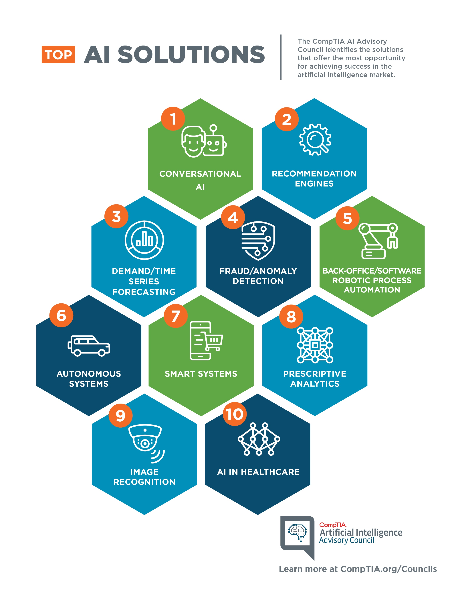

# AI-Powered Solution Collateral Generator



## Overview
This project demonstrates a practical application of AI to automate the generation of solution collateral, which aligns very well with the job requirements for a Full Stack Engineer. The program uses OpenAI's GPT-3 to create rich, high-quality content based on a provided prompt.

## Features
- A Flask API to handle HTTP requests for generating solution collateral
- Integration with OpenAI's GPT-3 to produce high-quality text
- Example prompt to test functionality

## Prerequisites
- Python 3.8 or higher
- OpenAI API key

## Setup

### Step by Step

1. **Clone the repository:**
```bash
 git clone <your-repo-url>
 cd <your-repo-directory>
```

2. **Create a virtual environment:**
```bash
python3 -m venv venv
source venv/bin/activate  # On Windows: venv\Scripts\activate
```

3. **Install dependencies:**
```bash
pip install -r requirements.txt
```

4. **Set up your environment variables:**
Create a `.env` file in the root directory and add your OpenAI API key like this:
```
OPENAI_API_KEY=your_openai_api_key_here
```

5. **Run the application:**
```bash
python file_name1.py
```

## Using the Application

Once the server is running, you can send a POST request to `http://127.0.0.1:5000/generate` with a JSON body containing the prompt.

### Example Request
```bash
curl -X POST http://127.0.0.1:5000/generate -H "Content-Type: application/json" -d '{"prompt": "Generate solutions collateral for a product launch"}'
```

### Example Response
```json
{
  "result": "Here is your automatically generated solutions collateral..."
}
```

## Conclusion
This project shows how you can integrate AI to automate and enhance the process of generating solution collateral, making it easier for skilled professionals to focus on more strategic tasks. With this setup, you showcase your ability to bridge front-end and back-end development while leveraging state-of-the-art AI technology.

